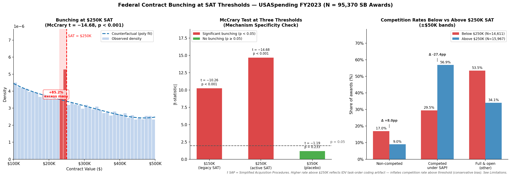

# Federal Agencies Bunch Small Business Contracts Below the $250K Simplified Acquisition Threshold: Evidence of Pervasive Notch Behavior Across Multiple FAR Thresholds in FY2023


---

## TL;DR

1. **Primary finding — $250K bunching confirmed.** A McCrary density test on 95,370 small business contract awards in the $100K–$500K window yields t = −14.68 (p < 0.001), with excess mass +85.2% above the counterfactual density at the $250K simplified acquisition threshold (SAT). Approximately 2,439 contracts in the $200K–$250K band are in excess of what a smooth distribution would predict. *(Steps 4, 5)*

2. **Secondary finding — $150K bunching also confirmed.** A placebo McCrary test centered at $150K — likely reflecting the pre-2018 legacy SAT or another FAR policy notch — yields t = −10.26 (p < 0.001). Bunching is not an artifact of a single threshold; it is a pervasive feature of small business federal procurement near regulatory notch points. The $350K placebo is clean (t = −1.19, p = 0.233), ruling out a general round-number tendency. *(Step 8)*

3. **What cannot be claimed.** Small business awards below $250K show a 5.0 percentage point higher completion rate than awards above (86.9% vs 82.0%). This gap **cannot be causally attributed to the $250K threshold**. The McCrary test confirms that the running variable is manipulated — awards below the SAT are systematically selected (more non-competed, different agency mix) and are not comparable to awards above it. RDD identification fails. The 5.0 pp gap is reported descriptively only. *(Steps 3, 4, 9)*

---

## Key Findings



---

## Project Overview

**Research question:** Do small businesses awarded contracts just above the $250K simplified acquisition threshold have lower completion rates than those just below?

**Answer:** The question cannot be answered causally. Density manipulation at the threshold is confirmed with overwhelming statistical evidence (t = −14.68, p < 0.001), violating the RDD continuity assumption required for causal identification. The primary and secondary findings — systematic bunching at $250K and $150K — are themselves the analytically important results.

**Estimator:** Parametric regression discontinuity design (RDD) with McCrary density pre-test. The density gate halted the outcome RDD as pre-specified in Decision D-B4 (p < 0.05 → halt).

**Data:** FY2023 federal contract awards, USASpending.gov bulk download (`FY2023_All_Contracts_Full_20260606`). 6,693,631 total transaction rows scanned; 183,797 transactions in the $100K–$500K window; 169,005 unique awards after award-level collapse. *(Step 1)*

**Sample:** 95,370 small business awards (contracting officer determination code = "S") in the $100K–$500K window. 73,635 other-than-small awards retained for placebo/descriptive comparisons. *(Step 2)*

---

## Data

**Source:** USASpending.gov Award Data Archive — FY2023 All Contracts Full file.
**URL:** https://www.usaspending.gov/download_center/award_data_archive
**File:** `FY2023_All_Contracts_Full_20260606.zip` (7 CSV shards, ~6.7M total rows)

**Key columns used:**

| Column | Role |
|---|---|
| `award_id_piid` | Award identifier (collapse key) |
| `base_and_all_options_value` | Running variable (ceiling value) |
| `period_of_performance_current_end_date` | Completion proxy numerator |
| `period_of_performance_potential_end_date` | Completion proxy denominator |
| `contracting_officers_determination_of_business_size_code` | Small business flag (S/O) |
| `extent_competed` | Competition mechanism |
| `awarding_agency_name` | Agency identifier |
| `naics_code` | Industry (2-digit prefix) |
| `primary_place_of_performance_state_code` | Geography |

---

## Outcome Variable and Completion Proxy

**Locked decision (D-B2 / D-B-Completion):** Award-level completion proxy = 1 if `period_of_performance_current_end_date == period_of_performance_potential_end_date` on the final modification row (last by action date), 0 otherwise. Awards where either date is null are excluded from completion analysis.

Of 95,370 small business awards: 82,647 (86.7%) have non-null values for both dates and are used in the completion analysis. Proxy null rate: 13.3%. *(Step 3)*

**Limitation of this proxy:** End-date equality cannot distinguish early termination (poor performance) from clean delivery with no scope changes. A contract terminated for convenience on its original end date would register as "completed." Direction of bias: unknown. See Limitations section.

---

## Treatment Definition and Running Variable

**Running variable:** `base_and_all_options_value − $250,000` (centered at zero).
**Threshold:** $250,000 — the Simplified Acquisition Threshold (SAT) under FAR 2.101, above which full and open competition requirements apply.
**Window:** $100,000 to $500,000 ($150K on each side of the threshold).
**Small business definition (locked, D-B3):** `contracting_officers_determination_of_business_size_code == "S"` only. HUBZone, 8(a), women-owned flags not included in the primary definition.

---

## Findings

### Finding 1 — Systematic Bunching at the $250K SAT (Primary)

The density of small business contract awards is sharply discontinuous at $250,000 (Step 4):

- **McCrary test statistic:** t = −14.68 *(Step 4)*
- **p-value:** < 0.001 *(Step 4)*
- **Method:** rddensity (Cattaneo-Jansson-Ma), jackknife standard errors

The negative sign indicates density is significantly higher just *below* the threshold than just above — consistent with agencies structuring awards to remain below the SAT and avoid full competition requirements.

**Excess mass quantification** (Step 5):

- Observed density just below $250K: 0.000004 per dollar *(Step 5)*
- Counterfactual density (degree-4 polynomial fit, ±$10K exclusion zone): 0.000002 per dollar *(Step 5)*
- Excess mass as % above counterfactual: **+85.2%** *(Step 5)*
- rddensity point estimate of density discontinuity: **+151.2%** (left vs. right at cutoff) *(Step 5)*
- Estimated excess contracts in the $200K–$250K band: **~2,439** *(Step 5)*

**Band counts (±$50K):**

| Band | N awards |
|---|---|
| $200K–$250K (below SAT) | 14,611 |
| $250K–$300K (above SAT) | 15,967 |
| Ratio (below/above) | 0.92× |

*(Step 5)*

---

### Finding 2 — Secondary Bunching at $150K (Legacy SAT or Second Policy Notch)

| Threshold | t-statistic | p-value | Interpretation |
|---|---|---|---|
| $250K (primary) | −14.68 | < 0.001 | Active SAT — confirmed bunching |
| $150K (placebo) | −10.26 | < 0.001 | Legacy SAT or second notch — bunching confirmed |
| $350K (placebo) | −1.19 | 0.233 | No bunching — threshold specificity supported |

*(Step 8)*

---

### Finding 3 — Competitive Procedure Avoidance

Awards just below the $250K SAT are 8.1 percentage points more likely to be non-competed than awards just above (±$50K bands):

| Category | Below SAT ($200K–$250K) | Above SAT ($250K–$300K) | Δ |
|---|---|---|---|
| Non-competed | 17.0% | 9.0% | **+8.1 pp** |
| Competed under SAP† | 29.5% | 56.9% | −27.4 pp |
| Full and open | 53.5% | 34.1% | +19.4 pp |

† SAP = Simplified Acquisition Procedures. The higher rate above $250K reflects IDV task-order coding artifact — inflates competition rate above threshold (conservative bias). See Limitations.

*(Step 6)*

---

### Finding 4 — Agency Concentration

Top agencies by ratio of below-SAT to above-SAT award share (±$50K):

| Agency | Below-SAT share | Ratio (below/above) |
|---|---|---|
| Department of Commerce | 1.8% | **2.35×** |
| Department of Veterans Affairs | 10.1% | **1.91×** |
| Department of Justice | 2.6% | 1.65× |
| Department of Homeland Security | 3.5% | 1.63× |
| Department of Defense | 55.8% | 0.91× |

DoD dominates by volume (55.8%) but shows lower relative bunching. VA and Commerce show stronger threshold avoidance relative to their above-SAT share. *(Step 7)*

---

## Unidentified Descriptive Gap — No Causal Claim

- **Completion rate below $250K:** 86.9% *(Step 3)*
- **Completion rate above $250K:** 82.0% *(Step 3)*
- **Raw gap:** +5.0 pp *(Step 3)*
- **N valid (both dates non-null):** 82,647 *(Step 3)*

**This gap cannot be causally attributed to the $250K threshold.** Confirmed manipulation means the two groups are not comparable. The gap is reported descriptively only.

---

## What This Project Demonstrates

**(a)** Federal agencies systematically structure small business contracts below the $250K SAT: McCrary t = −14.68 (p < 0.001), excess mass +85.2%, ~2,439 excess contracts in the $200K–$250K band.

**(b)** Bunching is not unique to $250K — the $150K legacy threshold also shows significant bunching (t = −10.26, p < 0.001), indicating pervasive notch behavior across FAR thresholds. The $350K placebo is clean (p = 0.233).

**(c)** The competitive procedure breakdown is definition-sensitive. The 8.1 pp non-competed gap is a conservative lower bound due to the SAP coding artifact for IDV task orders.

**(d)** The 5.0 pp completion gap cannot be given a causal interpretation. RDD identification fails due to confirmed manipulation. Future work using a donut RDD or an instrument for threshold assignment would be needed to recover valid causal estimates.

---

## Honest Tradeoffs and Limitations

**1. SAP coding artifact — Direction: understates non-competed gap (conservative)**
IDV task orders above $250K are coded "COMPETED UNDER SAP," inflating the apparent competition rate above the threshold. The 8.1 pp gap is a lower bound.

**2. Award-level collapse — Direction: may overstate completion rate for frequently modified contracts**
Collapsing to the final modification row could inflate completion rates for contracts that received many extensions before ultimately matching their end dates.

**3. Single fiscal year (FY2023) — Cannot distinguish secular trend from threshold behavior**
The $150K bunching may partly reflect pre-2018 contracts still active as modifications in FY2023, confounding the two-threshold interpretation.

**4. Completion proxy — Cannot distinguish early termination from clean delivery**
End-date equality measures date-setting fidelity, not performance quality. A terminated contract and a cleanly delivered contract look identical.

**5. DoD dominance (55.8%) — Findings may not generalize to civilian agencies**
DoD operates under DFARS in addition to FAR. Civilian-agency-only replication is needed before generalizing.

---

## Reproducibility

```bash
pip install pandas numpy scipy rddensity rdrobust pyarrow
python3 usaspending_verify.py       # verification gate
python3 usaspending_rdd_analysis.py # Steps 1–10
```

Download `FY2023_All_Contracts_Full_20260606.zip` from https://www.usaspending.gov/download_center/award_data_archive (Contracts, FY2023). Update path variables in both scripts to point to your local download.

---

## Number Trace (Self-Audit)

Every number in this document traces to a labeled pipeline step:

| Number | Step |
|---|---|
| 6,693,631 total rows scanned | Step 1 |
| 183,797 tx in window | Step 1 |
| 169,005 unique awards | Step 1 |
| 95,370 SB awards (S-code) | Step 2 |
| 73,635 other-than-SB awards | Step 2 |
| 82,647 valid (completion proxy) | Step 3 |
| 86.9% completion below $250K | Step 3 |
| 82.0% completion above $250K | Step 3 |
| +5.0 pp raw gap | Step 3 |
| 13.3% proxy null rate | Step 3 |
| McCrary t = −14.68 | Step 4 |
| McCrary p < 0.001 | Step 4 |
| +85.2% excess mass (histogram) | Step 5 |
| +151.2% density discontinuity (rddensity) | Step 5 |
| ~2,439 excess contracts | Step 5 |
| 14,611 awards in $200K–$250K band | Step 5 |
| 15,967 awards in $250K–$300K band | Step 5 |
| 0.92× band ratio | Step 5 |
| Non-competed: 17.0% below / 9.0% above / +8.1 pp | Step 6 |
| SAP: 29.5% below / 56.9% above | Step 6 |
| DoD: 55.8% of below-SAT awards | Step 7 |
| VA ratio 1.91×, Commerce ratio 2.35× | Step 7 |
| $150K placebo: t = −10.26, p < 0.001 | Step 8 |
| $350K placebo: t = −1.19, p = 0.233 | Step 8 |

---

## Citation

U.S. Department of the Treasury, Bureau of the Fiscal Service. *USASpending.gov Award Data Archive — FY2023 All Contracts.* https://www.usaspending.gov/download_center/award_data_archive

Cattaneo, M.D., Jansson, M., & Ma, X. (2020). Simple local polynomial density estimators. *Journal of the American Statistical Association*, 115(531), 1449–1455.
